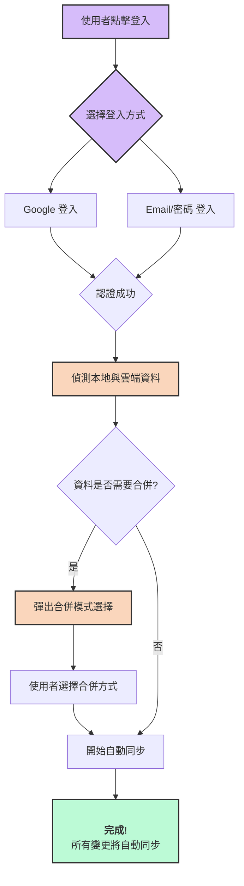

<div align="center">
  
  <h1 align="center">RecordTimeLabel - 您的終極影音時間標籤管家</h1>
  <p align="center">
    一款專為 Twitch 和 YouTube 設計的瀏覽器擴充功能，讓您輕鬆記錄、整理、並隨時重溫影片的精彩瞬間。
  </p>
  <p align="center">
    <a href="#-核心功能亮點">功能亮點</a> •
    <a href="#-安裝指南">安裝指南</a> •
    <a href="#-如何使用">如何使用</a> •
    <a href="#-貢獻指南">貢獻指南</a>
  </p>
</div>

---

## 🚀 為何選擇 RecordTimeLabel？

在資訊爆炸的時代，無論是追VOD、看實況、還是線上學習，我們經常需要在長影片中找到關鍵時刻。RecordTimeLabel 徹底解決了這個痛點，它不僅僅是一個時間標籤工具，更是一個智能化的個人影音資料庫。

- **不再迷失於時間軸**: 告別手動記錄時間點的繁瑣，一鍵標記，永不遺失。
- **資料永不丟失**: 強大的雲端同步功能，讓您的心血結晶安全地保存在雲端，並在多台裝置間無縫同步。
- **化繁為簡**: 獨家的「智能整理」功能，能自動將數百個來自不同頻道的紀錄分門別類，讓您的資料庫井然有序。
- **沉浸式體驗**: 直接在影片播放器上提供控制按鈕，無需切換視窗，操作一氣呵成。

---

## ✨ 核心功能亮點

| 功能 | 簡介 | 主要優勢 |
| :--- | :--- | :--- |
| **☁️ 雲端同步** | 支援Google/Email登入，所有資料自動備份至雲端。 | **跨裝置同步、資料永不遺失、安全可靠。** |
| **✨ 智能整理** | 一鍵將紀錄依據頻道名稱自動建立資料夾並歸檔。 | **省時省力、自動化分類、告別手動整理。** |
| **🗂️ 批次操作** | 提供批次選取、移動、刪除功能，高效管理大量紀錄。 | **效率極高、操作直覺、管理大量資料不費力。** |
| **🖱️ 右鍵選單** | 快速編輯筆記、複製帶時間戳的連結、刪除等常用操作。 | **操作流暢、功能整合、減少點擊次數。** |
| ** embeds  內嵌按鈕** | 在Twitch/YouTube播放器上直接新增紀錄，無需打開主介面。| **沉浸式體驗、快速標記、不中斷觀看流程。** |
| **⏱️ 時間戳偏移** | 可設定「回溯」秒數，精準捕捉剛錯過的精彩瞬間。 | **精準定位、彌補延遲、紀錄更準確。** |
| **🌐 多語言支援** | 內建繁體中文、英文、日文，並可隨時切換。 | **友善全球使用者、無語言障礙。** |

---

## 🛠️ 如何使用

### 1. 新增時間紀錄

- **方法一 (推薦)**: 在 YouTube 或 Twitch 影片播放頁面，點擊播放器上方/下方的 **「新增紀錄」按鈕**。
- **方法二**: 打開擴充功能主視窗，點擊右下角的「新增紀錄」按鈕。

### 2. 整理您的紀錄

<div align="center">
  
  <p><em>一鍵啟動智能整理，告別雜亂</em></p>
</div>

當您的紀錄變得繁多時，點擊主介面右上角的 **「整理」按鈕**。系統將會：
1.  掃描所有紀錄的頻道名稱。
2.  自動建立對應的資料夾。
3.  將紀錄歸檔到正確的資料夾中。

### 3. 使用雲端同步



1.  點擊主介面右下角的 **雲端狀態圖示**，選擇登入。
2.  登入成功後，您的所有資料將自動同步至雲端。
3.  您可以在任何已登入的裝置上存取和管理您的時間紀錄。

### 4. 更多強大功能

- **批次管理**: 點擊「批次模式」按鈕，即可勾選多筆紀錄進行移動或刪除。
- **編輯筆記**: 在任一筆紀錄上點擊右鍵，選擇「編輯筆記」來添加更多細節。
- **分享連結**: 在紀錄上點擊右鍵，選擇「複製帶時間戳的連結」，即可快速分享給朋友。

---

## 📥 安裝指南

1.  前往 [Chrome 線上應用程式商店]() (連結待補) / [Github Releases]() (連結待補)。
2.  點擊「加到 Chrome」。
3.  安裝完成後，在瀏覽器右上角的擴充功能列表中點擊 RecordTimeLabel 圖示即可開始使用。

---

## 🤝 貢獻指南

我們非常歡迎各種形式的貢獻！無論是回報問題、建議新功能，還是直接貢獻程式碼。

1.  **Fork** 此專案。
2.  建立您的功能分支 (`git checkout -b feature/AmazingFeature`)。
3.  提交您的變更 (`git commit -m 'Add some AmazingFeature'`)。
4.  將您的分支推送到遠端 (`git push origin feature/AmazingFeature`)。
5.  開啟一個 Pull Request。

請確保您的程式碼遵循專案的風格指南，並為新功能添加適當的測試。

---

<div align="center">
  <strong>立即安裝 RecordTimeLabel，開啟您的智能影音管理新體驗！</strong>
</div>

# RecordTimeLabel - 時間標記擴充功能

精準記錄Twitch和YouTube直播時間點的Chrome擴充功能，支援時間標記管理和快速跳轉播放。

## 🚀 主要功能

- ✨ **精準時間記錄**：一鍵記錄當前直播時間點
- 📁 **資料夾管理**：自訂資料夾分類管理時間標記
- 🎯 **快速跳轉**：點擊標記即可跳轉到對應時間點
- 📝 **筆記功能**：為每個時間點添加自訂筆記
- 🎨 **優美界面**：全新設計的現代化UI，支援拖放排序
- 🌙 **深色模式**：自動適應系統主題
- 🎭 **平台主題**：Twitch和YouTube不同的視覺主題

## 🔧 最新修復 (v2.8.1) - 採用備份版本邏輯

### ✅ 完全採用備份版本的成功邏輯

**重大改進**：將專案徹底重構為使用備份版本中經過驗證的時間檢測邏輯。

**核心變更**：
1. **簡化選擇器策略**：
   - 直播檢測：使用單一可靠選擇器 `.live-time > span[aria-hidden="true"]`
   - VOD檢測：按優先級順序測試選擇器陣列
   - 完全移除複雜的API調用邏輯

2. **邏輯流程優化**：
   ```javascript
   // 直播優先邏輯
   let timeElement = document.querySelector(LIVE_TIME_SELECTOR);
   let isLiveStream = true;
   
   // 如果非直播，測試VOD選擇器
   if (!timeElement) {
     isLiveStream = false;
     for (const selector of VOD_TIME_SELECTORS) {
       // 按優先級測試每個選擇器
     }
   }
   ```

3. **驗證機制**：
   - 時間格式驗證：`/^(\d{1,2}:)?\d{1,2}:\d{2}$/`
   - 確保獲取真正的時間而非其他數據

### 🧪 測試功能更新

#### 1. **testSimpleTime** - 分層測試
```javascript
// 使用方式
chrome.tabs.query({active: true, currentWindow: true}, function(tabs) {
    chrome.tabs.sendMessage(tabs[0].id, {action: "testSimpleTime"});
});
```

**測試流程**：
- 首先測試直播選擇器
- 如失敗，按順序測試所有VOD選擇器
- 提供詳細的控制台輸出

#### 2. **getCurrentTime** - 完整時間獲取
```javascript
chrome.tabs.query({active: true, currentWindow: true}, function(tabs) {
    chrome.tabs.sendMessage(tabs[0].id, {action: "getCurrentTime"});
});
```

#### 3. **debugTimeSelectors** - 詳細調試
```javascript
chrome.tabs.query({active: true, currentWindow: true}, function(tabs) {
    chrome.tabs.sendMessage(tabs[0].id, {action: "debugTimeSelectors"});
});
```

### 📋 核心選擇器配置

#### Twitch直播時間
```javascript
const LIVE_TIME_SELECTOR = '.live-time > span[aria-hidden="true"]';
```

#### Twitch VOD時間（按優先級）
```javascript
const VOD_TIME_SELECTORS = [
  '[data-a-target="player-seekbar-current-time"]',
  '[data-test-selector="player-seekbar-current-time"]',
  '.player-controls__time .tw-semibold',
  '.player-controls__time-display .tw-semibold',
  '.player-controls__time [data-a-target="player-seek-time"]',
  // ... 更多備用選擇器
];
```

### 🎯 為什麼採用備份版本邏輯？

1. **穩定性**：備份版本已驗證可靠運行
2. **簡潔性**：移除複雜的API調用，直接使用DOM
3. **直接性**：獲取用戶實際看到的時間顯示
4. **兼容性**：同時支援直播和VOD場景

## 🎨 UI改進 (v2.8)

### 佈局優化
- 📏 **合理分割**：左側資料夾面板 180px，右側記錄面板自適應
- 📱 **整體尺寸**：擴充視窗增加至 480x600px，提供更舒適的使用體驗
- 🎯 **文字防切割**：資料夾名稱使用 `truncate` 類別防止文字溢出

### 視覺美化
- 🌈 **漸變背景**：使用漸變色彩增強視覺層次
- ✨ **美化滑動條**：自訂樣式滑動條，支援懸停效果
- 🔄 **流暢動畫**：統一使用 200ms 的過渡動畫
- 🎭 **陰影效果**：添加適當的陰影提升立體感

### 互動優化
- 🔘 **按鈕美化**：漸變背景、圓角設計、懸停效果
- 📝 **輸入框優化**：焦點環效果、圓角設計
- 🎯 **圖標尺寸**：統一圖標尺寸，提升視覺一致性
- 🖱️ **懸停反饋**：所有互動元素都有視覺反饋

## 🛠️ 技術架構

- **前端框架**：React 18 + Vite
- **樣式系統**：Tailwind CSS
- **拖放功能**：@dnd-kit/core
- **圖標系統**：Lucide React
- **Chrome API**：Manifest V3

## 🔧 安裝步驟

1. **下載或複製專案**
2. **安裝依賴**：`npm install`
3. **構建專案**：`npm run build`
4. **載入擴充功能**：
   - 開啟 Chrome 擴充功能頁面 (chrome://extensions/)
   - 啟用「開發者模式」
   - 點擊「載入未封裝項目」
   - 選擇 `dist` 資料夾

## 🎯 使用方法

1. **開啟Twitch或YouTube直播頁面**
2. **點擊工具列的擴充功能圖標**
3. **新增資料夾**（可選）：分類管理不同的時間標記
4. **新增紀錄**：點擊「新增紀錄」按鈕記錄當前時間點
5. **編輯筆記**：雙擊時間標記來編輯筆記
6. **快速跳轉**：點擊時間標記跳轉到對應時間點
7. **拖放排序**：拖動調整資料夾和記錄的順序

## 🐛 故障排除

### 時間記錄不準確
- 確認您在直播頁面而非VOD重播頁面
- 使用 `testSimpleTime` 測試選擇器
- 檢查瀏覽器控制台是否有錯誤訊息

### 擴充功能無法載入
- 確認已正確構建專案（`npm run build`）
- 檢查 manifest.json 配置是否正確
- 重新載入擴充功能

### 選擇器測試失敗
- 使用 `testSimpleTime` 指令逐步測試
- 使用 `debugTimeSelectors` 獲得詳細信息
- 檢查是否在支援的頁面上（Twitch/YouTube）

## 📚 版本更新

### v2.8.1 (最新)
- 🔄 **採用備份版本邏輯**：完全重構時間檢測機制
- 🎯 **簡化選擇器**：移除複雜邏輯，使用經驗證的方法
- 🧪 **改進測試**：更新所有測試功能以匹配新邏輯
- 🐛 **提升穩定性**：基於備份版本的穩定代碼

### v2.8
- 🎨 全新UI設計，優化佈局比例
- ✨ 美化滑動條和按鈕樣式
- 🔧 修復模塊載入問題
- 📏 增加視窗尺寸至480x600px

### v2.7
- 🔧 簡化時間檢測邏輯
- 🎯 改善選擇器優先級
- 📝 增強測試框架

## 🤝 貢獻

歡迎提交Issue和Pull Request來改善這個專案！

## 📜 授權

MIT License

# RecordTimeLabel_ui - 錄影直播時間標記工具

一個優雅的網頁插件，用於記錄 YouTube 和 Twitch 直播影片的時間戳，支援雲端同步和多設備共享。

## 主要功能

### 時間標記
- **即時記錄**: 一鍵記錄當前播放時間點，自動獲取直播標題和頻道資訊
- **精確跳轉**: 點擊記錄即可跳轉到對應時間點，支援 YouTube 和 Twitch
- **VOD 檢測**: 自動檢測影片是否有 VOD 可用，並標示狀態
- **筆記功能**: 為每個時間標記添加個人筆記和備註

### 資料管理
- **資料夾分類**: 自訂資料夾整理不同主題的時間記錄
- **拖放操作**: 直觀的拖放介面，輕鬆移動記錄和調整順序
- **搜尋過濾**: 快速搜尋頻道名稱、直播標題或筆記內容
- **智能整理**: 🆕 一鍵按頻道名稱自動整理記錄到對應資料夾

### 雲端同步
- **多設備同步**: Firebase 雲端同步，跨設備存取時間記錄
- **即時更新**: 記錄變更即時同步到雲端，多設備即時反映
- **離線支援**: 離線操作時會暫存本地，連線後自動同步
- **備份還原**: 匯出/匯入功能，支援資料備份和遷移

### 視覺體驗
- **群組顯示**: 按直播標題自動分組，展示頻道頭像和資訊
- **深色模式**: 支援淺色/深色主題切換，適應不同使用環境
- **響應式設計**: 適配不同螢幕尺寸，提供一致的使用體驗
- **動畫效果**: 流暢的動畫過渡，提升互動體驗

## 新功能：智能整理 🆕

### 按頻道整理記錄
新增的智能整理功能可以自動將同一頻道的記錄整理到對應的資料夾中：

**使用方式**：
1. 點擊記錄面板右上角的整理按鈕（橙色資料夾圖示）
2. 系統會掃描所有記錄的頻道名稱
3. 自動創建與頻道同名的資料夾（如果不存在）
4. 將記錄移動到對應的資料夾中

**智能特點**：
- 🔍 自動識別有效的頻道名稱
- 📁 智能創建或使用現有資料夾
- 🔄 批量移動記錄，快速整理
- ⚡ 一鍵完成整個整理過程

**適用場景**：
- 清理未分類的記錄
- 按照觀看的頻道整理內容
- 快速建立頻道專屬資料夾

## 安裝和使用

1. 下載並安裝 Chrome 擴充功能
2. 訪問 YouTube 或 Twitch 影片頁面
3. 點擊工具列的插件圖示開始使用
4. 登入 Google 帳號啟用雲端同步功能

## 支援平台

- ✅ YouTube（直播和影片）
- ✅ Twitch（直播和 VOD）
- 🌐 Chrome、Edge 等 Chromium 瀏覽器

## 技術特點

- **React 18**: 現代化的前端框架，提供流暢的使用者體驗
- **Firebase**: 可靠的雲端後端，確保資料安全和同步
- **Tailwind CSS**: 美觀的 UI 設計，支援深色模式
- **Drag & Drop**: 直觀的拖拽操作，簡化資料管理

---

**開發者**: 台V上的一朵雛菊🌼  
**GitHub**: [EsabiyaXCF/RecordTimeLabel](https://github.com/EsabiyaXCF/RecordTimeLabel)  
**版本**: v2.1